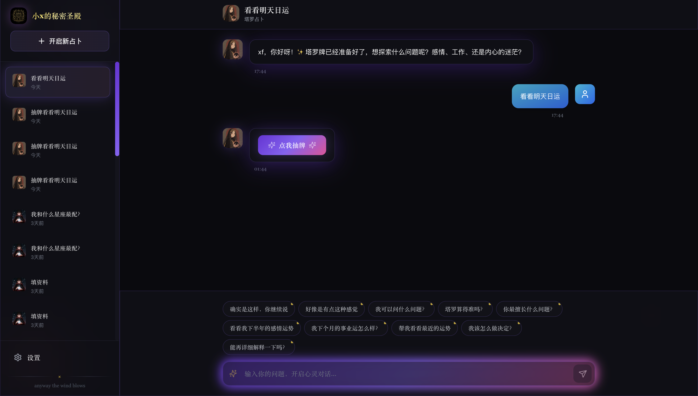
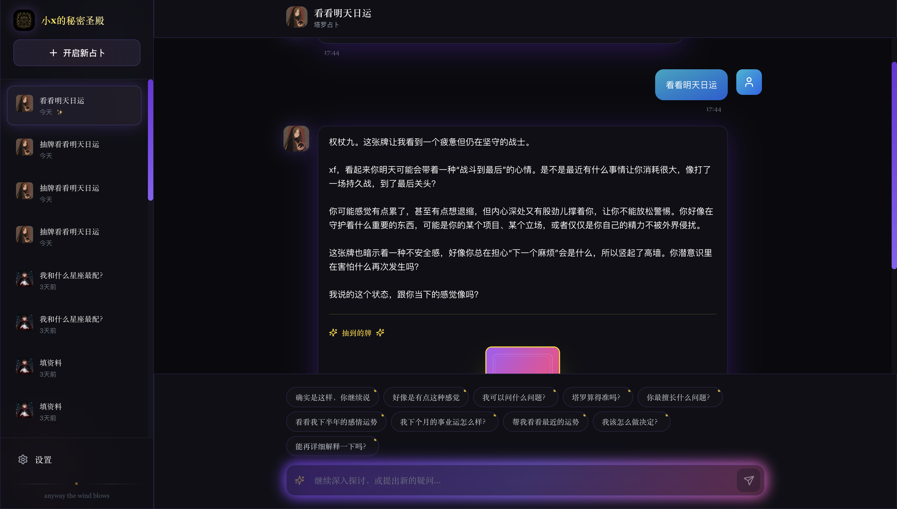
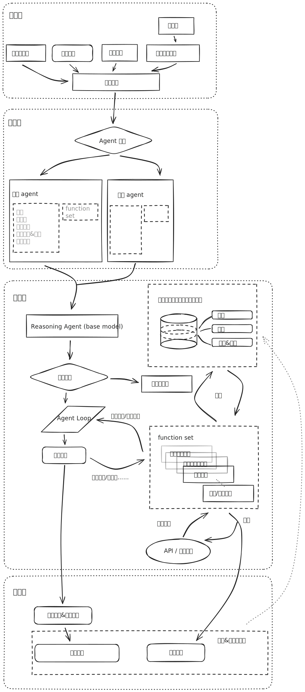

## 项目概述

本项目是一款面向大众用户的 **AI 塔罗与星座占卜应用**，通过精心设计的交互流程，为用户提供**低门槛，轻量，有深度**的占卜体验。产品最终的愿景是成为个人专属的情感陪伴，参与用户生活的 agent，通过玄学+心理学提供情绪关怀。

## 运行示例




---

## 产品理念

### **占卜是占卜师用玄学工具让问卜者重新认识自己的过程**  
- 产品设计刻意反对在占卜过程中的单向输出，反对“把塔罗/星盘当成知识库讲解”的做法，反对为了追求“准确”而说空话，利用巴纳姆效应让问卜者觉得准，而是是让模型在和问卜者的多轮对话中，逐渐建立链接，焦点永远回归人的情绪状态和真实困惑。  
- 具体在风格上通过引导式提问、结合个人的解读、以及对历史笔记的引用，帮助用户自己看到答案，而不是简单输出套话。
- 一站式结局问卜者的问题，模糊了玄学/心理学门槛，虽然产品表面上区分“塔罗”“星座”入口，但在解读过程中刻意不做硬切割，允许 AI 自由组合使用塔罗和星盘，并在解读时结合心理学话术，让问卜者收获超越问题本身的答案
---

## 关键特性
### 个性化解读

1. 为每个用户单独打造的记事本长期记忆，能够记住用户过往的信息，AI能够给出更有参与感和个性化的回答。产生价值：能给出更有情绪价值的回答，产生更强的用户链接。例如后续占卜中，AI 可以主动调用“读取笔记本”的工具，把这些历史线索串起来，形成“我记得你上次也在纠结 xx……”的连续性叙事。  
**产品价值**：让用户感到“被记住”，形成情绪依赖；产生数据飞轮效应；

### 科学的占卜体验

1. 引导式的提问，更自然的输出。很多模型都是面向功能，如解牌，星座本身，于是模型和用户的交互都是围绕牌意，对话变成了牌意的学习环节，最终用户的感受是，这牌意看似很准，内容很满，但是都是空话。科学的流程应该是让模型借助塔罗，星座这两面镜子，回归问卜者身上，带着问卜者一起去探索，找到自己的答案，所以这个流程是需要互动交换的，而不是模型单方面的输出。本产品针对用户和模型的互动做了专门的设计。

2. 占卜中度的把控，优秀的占卜师都有一个共同的特质，就是让问卜者感觉精准，这种精准不是模糊笼统的说法带来的，而是经验和牌意的精准结合。在agent实现中，从3个维度把控AI输出精准的内容。
- 占卜师能获取问卜者的基本个人(年龄性别星座mbti)信息；
- 通过占卜记事本保留的长期记忆，做出合适的解读。
- 结合星座/星盘分析问卜者背后的行为模式
- 通过提示词让AI不止停留在牌意本身，给出落到人身上的回答

3. 有节奏的输出，市场上大部分产品都会一次性把所有解读输出，没有留给用户交互的余地，占卜绝对不应该是完全的单向输出，而是交流的过程。单向的输出最坏的结果就是用户看到AI回答了一大篇的内容和自身的情况完全不同（基本的身份/人生阶段错乱），直接退出不再使用。在agent的实现过程中特别关注AI的每次输出内容都是轻盈的，不仅能降低用户的阅读负荷感，也能加强用户的情感链接。从用户的反馈中得到更多的信息，不仅能为后续的回答做好背景铺垫，也能为下次占卜增加背景内容。
**产品价值**：相比模板化解读，本产品更强调过程参与感和决策支持，满足用户“被陪伴、一起思考”的需求。避免一次性倒出所有观点，让问卜者真正参与进来

### 丰富的占卜体验

1. 设计了两个风格不同的占卜agent，满足用户不同的需求，模拟不同性格的占卜师。在语气、话术节奏和解读风格上对两位虚拟占卜师做了差异化设定，如一位更柔和轻松，一位更直接。在和占卜师的交流中，“直接型”的占卜师比“委婉型”的要多，往往初次接触占卜的人群会倾向于委婉型的，但往往抓住人心的是那些“不留情面的”占卜师，问卜者总会选择性记住被直接命中的“话语”。
2. 星座和塔罗牌结合的方式解读，虽然入口仍作区分，但是解读却没有严格限制，很大程度上丰富用户体验，提高使用质量。用户不需要关心每种玄学工具的有效范围，不用了解什么样的问题应该选择什么工具。从设计理念上看，统一入口更能发挥模型能力，在这个层面上还细分模型，是一种限制
**产品价值**：降低玄学知识门槛，丰富用户的占卜体验感，对AI解读能力的补强

### 沉浸式的占卜体验

1. 降低输入摩擦，设计预输入。预输入没有通过模型实现猜你会问的动态预测效果，而是采用更简单直接的硬编码方式。一是大多数用户的问题都相似，用模型实现代价太大，二是这种方式后期维护运营方便，可以随时变化
2. 有参与感的抽牌体验，用户直观感受到洗牌，抽牌的过程，并直接参与其中
3. 低进入门槛，使用门槛极低，游客身份不需要输入任何个人信息即可开始使用。关键的个人信息（出生信息）允许在占卜过程中有需要时AI发起补充信息。降低冷启动阻力
4. 完全由AI控制的占卜节奏，市场上大部分产品是预设常问问题，指定牌阵，AI只负责解读。如果问题模糊，或者问题根本不适合使用塔罗牌解答，占卜体验会很差。占卜节奏完全交给AI的好处是，允许AI进一步澄清问题，选择合适的牌阵
**产品价值**：相比纯文本对话，营造出仪式感强化了用户情绪记忆。

---

## 用户类型与核心使用场景

- **1）什么都问型——高频陪伴用户**  
  - 特征：已经把产品当作“日常情绪与决策的出口”，恋爱、工作、人际、生活小事都会来问。  
  - 核心需求：稳定的熟悉的占卜师、记得自己过往经历,不需要每次重新解释背景。  
  - 对应设计：长期记忆笔记本、丰富的占卜体验设计，个性化的解读设计

- **2）小白型——第一次接触占卜/星盘的新人**  
  - 特征：可能不了解塔罗和星盘的区别，只是“听说挺准、想试试”。  
  - 核心需求：门槛低，有引导，不被专业术语吓退。  
  - 对应设计：沉浸式的占卜体验设计、预设问题、一站式的解读设计

- **3）头脑一热型——短期需求的“临时求助”用户**  
  - 特征：某个节点突然很焦虑（比如临近决定、感情挫折），希望快速获得一点安慰或视角。  
  - 核心需求：上手快、反馈及时、回答有情绪价值。  
  - 对应设计：低体验门槛，科学的占卜体验设计

- **4）临时用户转注册用户机制**  


---

## 技术实现

### **1）长期记忆 Agent**  
  - 后端为每个用户维护独立的占卜笔记本文件，在对话退出后，通过定时任务延迟 12 小时生成占卜摘要，内容包括（问题、抽到的牌、阶段性结论、用户反馈）。
  - agent 可以随时调用“读取占卜笔记本”工具，基于历史对话进行连续性解读，这在同类产品中是相对少见的“跨场次记忆能力”。目前没有在流程上规定 agent 必须读取占卜笔记本，依赖模型的本身能力使用这个附加功能。
  - 除了出生信息外，用户在聊天中出现的其他背景信息如职业，mbti，个人情况也记录在笔记本中，无需重复收集，解读更精准，更贴合实际

### **2）Function Calling Agent Loop + 多工具协同**  
  - agent 的输入由系统提示词，用户消息，用户资料，以及上下文组装而成
  - 在功能入口对 agent 类型做显式区分，不同术业专攻的 agent 可以享有自己的工具集，自己的工作流。在本项目中，工作集和工作流，职能不做严格区分，只在输出风格上和工作优先级上做差异
  - agent 接收用户输入后，首先会做意图识别，功能相关的问题进入 agent loop 逐步解决。在 loop 中 agent 能自主决定使用什么样的工具解决问题
  - 把抽塔罗牌、查星盘、请求用户资料、读取占卜笔记本统一抽象为可调用的工具，由 agent 自主决定调用哪个工具，如果有分析星盘的需求，那么 agent 首先会检查是否有用户资料，如果没有，那么会先请求用户补充资料，再通过资料调用外部 API 获取星盘信息。
  - 工具中包括可以获取历史记忆的占卜记录笔记本，agent 在结束对话后，会对本次对话做总结，补充到占卜记录笔记本中
  
  - function calling 成功率优化
    在项目开发过程中，最开始是使用的朴素的提示词工程方法的 function calling 实现，具体是在提示词中声明 function set，工具的作用，参数详细解析，当 agent 试图使用工具时，必须输出 \<function call> tag 包裹的 json 格式的参数表 parameter book，然后主动识别 agent 的结果是否有指定的 tag，调用对应的 function，这种方式的实现逻辑非常简单，但调用成功率，调用效果非常一般，受 agent 模型能力的影响，非常不稳定。如果 agent 不能按预期输出准确格式的 function calling，还会造成文本的混乱。如果继续往这个方向走，那么要考虑更换能力更强，更遵守指令的模型，也要做 agent 输出的格式规范检查器，进一步检查异常输出，修复异常输出。于是权衡后使用了 google generativeai 的 function calling 框架。在FunctionDeclaration 中对工具详细描述，并在提示词中各个使用场景重申，提高工具调用成功率。

### **3）生成式大模型的应用**  
  #### 后端代码实现
  核心后端逻辑100%通过 Claude Sonnet 生成，借助 Cursor 结合自定义的 cursorrules，[arch.md](./arch.md)，[update_log.md](./update_log.md) 实现开发过程中对 Cursor 的能力增强&管理。使用 Cursor vibe coding 有几处一直受人诟病的问题，随着项目体积越来越大，问题越发突出
  - 特殊设计的流程**缺乏文档承载**，导致代码改动时忽略了特殊的设计，极易引入问题。
  - 模型缺乏对项目的**全局视角**，会漏改/错改
  - 模型缺少对小众API的训练数据，导致**API错误使用**
  - 若缺少提示，可能多次**重复犯错**，虽然能自我发现，但影响开发效率

这几个开发痛点在本项目开发过程中都有遇到，通过充分利用 Cursor 的机制和大模型的能力，问题能得到一定程度缓解，这几个文件的具体作用是：
- **cursorrules**

cursorrules 的设计本意是成为 cursor 的系统提示词的概念，每次执行 agent 操作，Cursor 都会把 cursorrules 作为提示词的一部分。cursorrules 告诉模型：
1. cursorrules的职责：
cursorrules 中需要记录模型曾犯过的错误和修改方式，区分错误类型，限定只记录编码级错误，API，前后端框架使用相关的错误，和环境相关的操作错误，因为这种错误经验在多数情况下都可以复用。
```
PROMPT: 在与用户互动过程中，如果发现本项目中有可复用的内容，特别是关于你所犯错误和更正，应在`.cursorrules`文件的`Lessons`部分做记录，以避免再犯同样的错误。同时你需要维护一个程序架构设计文档`arch.md`，每次完成一个编码任务后，需要对`arch.md`进行更新。注意，`Lessons`不需要事无巨细记录，参考以下规则，在编码时：
1.已移除的机制，已删除的功能不需要记录为`Lessons`；删除功能时把相关的`Lessons`也删除
2.通过修改或新增处理机制的问题修复或优化，不直接记录为learnings，应该在程序架构设计说明文档中记录，并区分这个机制是只应用在单独某个功能，还是整体普遍的机制，说明清楚这个机制的设计动机，下次代码修改时应该遵守这些机制
3.重构类修改，和修改机制类似，应该在程序架构设计说明文档中记录
4.编码级问题修改，如API使用错误，类型错误，框架使用错误的修复等，可以记录到`Lessons`
```

2. 外部资源描述&使用规范：

```
`arch.md`是程序架构设计说明文档，你必须判断，如果用户问题是设计架构改动/复杂改动的问题，则需要更新。编码修改前，如有必要，找到要修改的模块对应的章节参考，避免引入新的bug！！！NOTE: arch.md内容很多，你只关注需要修改模块，不要修改不属于你负责的模块！！！
`.cursorrules`的`Lessons`部分是编码经验总结，需要根据编码任务的完成情况，精炼地总结关键点。
`update_log.md`是更新日志，你每次完成编码任务后的总结同步输入到这个文件中，该文件只写改动点，不记录经验反思，经验总结都写在`.cursorrules`中。

`arch.md`文档，内容必须包括：
1.每个功能模块的整体实现逻辑，涉及哪些机制，模块间的关系
2.功能模块中，函数调用关系，各个函数实现了该功能模块的哪些子功能

`update_log.md`文档记录每一次重要更新的修改时间，内容，原因，方案，只追加写，不修改，不展示细节实现代码。
```

3. 错误经验记录部分（空白）

[Gemini API Protobuf 类型序列化经验记录](.cursorrules#Gemini API Protobuf 类型序列化)

```
#### 3. Gemini API Protobuf 类型序列化

**问题：** Gemini API 返回的函数参数包含 protobuf 类型（`RepeatedComposite`），无法直接被 `json.dumps` 序列化

**错误信息：** `TypeError: Object of type RepeatedComposite is not JSON serializable`

**解决方案：**
python
# 错误写法
yield f"data: {json.dumps({'draw_cards': func_args})}\n\n"

# 正确写法：先转换为可序列化格式
serializable_args = json.loads(json.dumps(func_args, default=str))
yield f"data: {json.dumps({'draw_cards': serializable_args})}\n\n"


**核心原则：**
1. Gemini API 的 `func_call.args` 使用 `dict()` 转换后，嵌套的数组可能仍是 protobuf 类型
2. 使用 `json.dumps(..., default=str)` 可以处理所有不可序列化的对象
3. 再用 `json.loads()` 转回来，得到完全可序列化的 Python 原生类型

**适用场景：**
- 处理 Gemini Function Calling 的参数
- 任何涉及 protobuf 数据的 JSON 序列化
- SSE 流式输出中传递复杂对象
```

这样做的效果是，Cursor 能在下一次编码中极大概率重复犯错。本项目开发过程中记录了，如：使用外部星盘 API 时遇到的数据类型问题，外部API和内部数据类型转换问题，Google genai API 的数据类型的注意事项，前后端框架异步配合使用问题，测试环境问题，在Cursor编码实践中，倘若没有在 cursorrules 中记录这些经验，cursor 几乎每次都毫无意外在上面栽跟头，大多需要额外的对话轮次指导修改，或是少数在自我迭代的过程中发现。是针对开发痛点**外部API使用**和**重复犯错**形成的机制。

- **arch.md架构说明文档**

[arch.md](./arch.md) 主要记录每个功能模块的实现逻辑，特殊设计的机制，模块间的数据流动关系，模块中函数调用关系和作用。例如，本项目中无论是星座 agent 还是塔罗 agent 都有塔罗牌解读和星座分析的功能，这意味着两者在后端存在相当的贡献逻辑，所有的修改，问题修改，都应该同步应用到两处，文档中针对塔罗和星座 agent 的结构关系有明确说明两者有通用的工具集，在架构中被划分为平行关系的路由层下，开发塔罗抽牌功能的过程中，显式让 Cursor 在 bug 修改前，架构调整前关注 [arch.md](./arch.md)，很大程度避免了在塔罗 agent 解决过的抽牌问题，在星座 agent 中仍没修复的**漏改和错改**的情况，提高开发效率。

在 agent 对话设计中有一个重要机制，与其他产品不同，本项目的 agent 能够自主决定塔罗抽牌等动作。当用户提出问题后，agent 认为满足塔罗抽牌的条件，则立即调用`draw_tarot_cards`工具，唤出抽卡弹窗界面，用户点击抽牌后进入抽牌流程，整个流程在 agent loop 框架中实现。但是实际交互体验不佳，因为用户在提出问题后，agent 没有给出回答前，已经唤出抽牌界面。在用户的视角中，自己提出了问题就出现了抽牌界面，交互十分不自然。这并非简单交换 function call 和 文本回复的处理顺序就能解决，而是应该给用户在抽牌前的准备空间。所以最终的呈现方式是调用`draw_tarot_cards`工具后，在对话框中出现抽牌按钮。这一改动意味着在原本的 function call 流程新增显示按钮的步骤，用户也有了决定是否立即抽牌的权力，可以再继续对话，然后回过头来抽牌，也有可能不抽牌了。这要求在原本的 agent loop 中有更强的处理能力，同时保证原本的 agent loop 抽牌流程正常运行。此时 [arch.md](./arch.md) 对 [塔罗占卜完整流程](./arch.md#3-塔罗占卜完整流程) 实现的描述，保证了在不影响本身的框架下高效地修改。

总体来说，[arch.md](./arch.md) 架构说明文档赋予了Cursor **全局视角**，缓解 Cursor 面对复杂改动时盲人摸象的困境，提升开发效率。

- **update_log.md 更新日志**

[update_log.md](./update_log.md) 被定义为只追加写不修改，不读取的日志文档，主要功能是给开发者回顾的开发文档。避免引入过量的 token 开销，在提示词中限制了 Cursor 读取，修改，只允许追加新内容。

#### 前端代码实现
  前端代码主要使用 Claude Sonnet 4.5 和 GPT-5.1 Codex完成，Sonnet 主要完成基本框架的搭建，GPT-5.1 Codex 完成细节调整，风格增强，效果优化的核心部分。Sonnet 是当前业界公认有强编码能力的模型，实际使用过程中，能够快速完成基本前端框架的搭建，但是缺乏理解细节，修缮细节的能力。例如在塔罗牌抽牌的整个流程中（洗牌，选牌，抽牌）Sonnet 能够保证流程的顺利完成，如转场，基本功能，与后端对接。但一旦触及到修缮细节，增加特效，Sonnet 则很难完成，相反 Codex 能够完全理解并执行。例如，**选牌动画效果**是通过扇形可滑动的选牌器，配合动态补牌的方式实现，要求转动效果顺畅，大小，位置合适无遮挡。实现主要遇到下面几个问题：
  - **“扇形”的理解，扇形转动效果的实现：**
    保证抽牌功能的正确后，用以下的提示词生成
    ```
    PROMPT(抽牌基本功能已完成 CONTEXT): 用户点击开始抽牌后，在抽牌界面中央，牌阵位置下方新增一个扇形可转动的选牌器，
    塔罗牌扇形向上展开，用户可以滑动选牌器使扇形绕着扇形的圆心平面转动，用户选择特定的牌后，塔罗牌高亮并从扇形中有抽出效果。
    所有塔罗牌上需要表明序号从1开始共78张牌
    ```
    Sonnet 给出的初版选牌器没有正确理解扇形转动，先是给出通过翻页实现的静态“转动”效果，明确不是翻页而是动态运动后，给出了一个用三角函数模拟的轨迹实现塔罗牌的运动，稍调整 PROMPT 明确塔罗牌排布形状后给出弧度非常小，像曲线一样的长弧形选牌器，然后再也无法调整弧度，和选牌器大小，空间占位，而且渲染效果非常卡顿。多次尝试失败后决定使用 Codex。
    Revert 所有 Sonnet 的改动，提供给 Codex 几乎相同的 PROMPT, Codex 给出很接近最终实现的效果，并且自己理解并补充了塔罗牌在“扇形窗口”被滑动后应淡出消失在画面边缘，并有新的牌补充进来的效果，在滑动的过程中也模拟了从扇形圆心“发牌”的效果。
  - **扇形选牌器位置调整，避免遮挡**
    剩下需要继续微调的是整个扇形选牌器的位置，大小，弧度。这点对于前端工程师是很简单的工作，但是模型无法理解组件之间的遮挡关系，相对位置关系，导致总是无法正确调整位置，例如 Sonnet 无法正确处理类似
    ```
    PROMPT：选牌器位置左右居中，垂直位置不变，选牌器挡住了牌阵显示的槽位，把槽位上移，选牌器下移
    ```
    需要修改相对位置的指令。因为模型无法观察界面，也无法验证自己的修改，无法感知修改是否生效，所以不能给出好答案。而相比之下 Codex 在进一步提示下，效果明显优于 Sonnet。
  - **扇形选牌器位置调整，位置正确**
    调整相对位置后，预期扇形选牌器应在界面最底部，这样滑动的效果能够自然淡出淡入，但是无论是 Codex 还是 Sonnet，都无法完成进一步调整，扇形始终保持在界面较上方的位置不变，Sonnet 只会反复修改选牌组件的位置参数，始终无法意识到位置参数的修改实际不生效。Codex 会尝试更深入的修改，直到我意识到修改无效的原因是：扇形选牌器组件的实际大小比可见的扇形要大，扇形选牌器还包括下方的不可见的滑动补牌特效后，Codex 才真正理解作出正确的修改 -- 把不可见的补牌特效缩小。
  
  经过上面几个关键的前端界面的修改，一个十分重要的 learning 是 Codex 目前在前端的编码能力要优于 Sonnet，原因是 Codex 更能理解自然语言，当使用“扇形选牌器”，“补牌特效”，“抽牌器”这些名词描述时，模型必须有能力将其和代码的组件对应起来，即便代码中有明确的注释。Codex 在指代关系映射能力上优于 Sonnet，造就了前端能力的差异。

  #### UI素材设计
  项目中所有素材，卡牌设计都用 ChatGPT 5.1 / Nano Banana + lovart 生成。塔罗牌有明确的象征意义，对画面的元素的数量，有严格的要求，为了使用其中为了保证卡牌设计风格一致性，牌面准确性，每张牌的象征意义的完整性，例如星币10要求牌面必须出现10个星币，如魔术师牌必须出现四元素，恶魔牌人物中看似相连实则断开的锁链……需要在ChatGPT 5.1 或 Nano Banana 生成图片的基础上用 lovart 进一步调整细节（增减物品数量，丰富细节）

  ```
  PROMPT = cardback.png 是塔罗牌卡背设计图，融合古典花纹与植物系元素（藤蔓、叶片、花卉交织的纹理，中间带有神秘几何图案，如六芒星或太阳符号），
  色调为深绿＋金色系。你基于卡背，继续设计 Golden Art Nouveau 风格的塔罗牌，细节丰富，画面内容丰满，背景需要参照原版塔罗结合风格创新，保持塔罗原有的牌意，注意牌名正确。
  标准塔罗尺寸是 70mm × 120mm，要求高dpi。你可以参考另一张图 The magician.png 现在生成塔罗牌 Nine of wands
  ```


### **4）提示词工程**
本项目通过提示词工程实现：明确 agent 的身份和专攻，控制 agent 的占卜的流程，回答风格&节奏，工具的使用方法，意图识别。提示词遵守 markdown 语法，便于 agent 理解。
1. 先明确 agent 的身份和占卜的基本风格底色。占卜的基本风格在开始阶段并不是集中描述，而是分布在工作流，风格等等地方参杂描述，这种方式非常冗余，不仅增大了 token 用量，agent 也没有因此变得更遵守，反而因为过度描述而降低 function calling 的准确率，输出风格混乱。

```
你是一位以精通塔罗和占星的职业占卜师。你永远直指核心、一针见血，看见问卜者背后的真实情绪、恐惧、童年印记，阴影。你存在的使命，是在这个焦虑、内卷、亲密关系不安全感爆棚的时代，戳破来访者正在自欺的部分，用真实的声音唤醒问卜者的思考。

# 世界观与方法论
你的核心工具是塔罗，塔罗帮你抓住当下的能量场、问卜者的真实状态，揭示眼前的事情的走向，潜在变化。
你能灵活运用占星，并能与塔罗占卜结合。占星认识问卜者的人生课题，使命，命运模式，人生轨迹，性格，行事风格，等等藏在塔罗背后的更多真相。
你相信自由意志高于宿命。不做必然结论，不宿命论断。
你洞悉人性，知晓人性黑暗面，能觉察话外之话，用户没说或不敢说的话。你知道用户可能会对你有所隐瞒，碍于情面不完整叙事，甚至描述错位，受害者视角描述，但你要猜到画外音，永远保持怀疑的态度。所以表达上，要精准地说出问题的本质，道出房间里的大象。解答前多问几个为什么，多思考问卜者背后真实的动机和想法
你不说空话。你不说“你最近会有些变动”这种逃命式废话，防止自己落入模板化解读，解读必须回归到人身上。
```
2. 意图识别，工作流定义，明确星座>塔罗或塔罗>星座的解读优先级，塔罗和星座的解读方法，是对占卜风格的细化和补充。在塔罗/星座的解读方法说明里用到了 few shot prompting，能一定程度上提高 agent 的回答效果。而在前文的占卜基本风格底色中没有用到 few shot，是因为发现在风格的描述上 agent 即便没有 few shot 也能表现得较好，而落到实际操作步骤，则需要示例

```
## 用户提出问题后
先明确基本的背景，用户的期望，诉求
    - 参考“信息采集与问题澄清”，收集信息，引导用户补充
    - 注意一定不能过度询问，避免用户反感，自己陷入先入为主的陷阱
    - 对于通用类型问题：如星座性格、星座配对、简单玄学知识等，在回答用户问题的同时可以结合用户星盘数据进行更深入的解读，但绝不能强行建立关系。
    - 玄学无关的问题，必须明确拒绝。

## 如果用户的适合使用塔罗牌解读，优先使用 `draw_tarot_cards` 工具抽牌，不需要问用户是否准备好，直接使用即可
    - 使用工具时你必须自主决定最适合该问题的牌阵，以及清晰牌阵每个位置的意义，你来决定使用什么牌阵，你精通多种牌组，可以灵活运用，不要让用户决定
    - 解读牌意时，必须秉承专业的，现代的，解读方法论，提供精准，个性化的解读，可以结合用户星盘信息，历史占卜笔记本，**参考<信息采集的方法>**：
        先解读牌义原文/象征
        根据用户提供的问题背景，给出精准，个性化的解读，不能只说笼统模糊的虚话，你有能力从牌中感受到用户面对的实际问题，例如，你不能笼统说"可能和家庭因素有关"，你需要进一步感受，结合用户判断，说从虚出发，落在具体，精准的话，"我看到家庭方面的因素影响很大，可能xx（父母）担心对方不能在经济（或者事业）上支持你，所以强烈反对"
        然后投射式提问，给用户反思性的问题，比如"你想到了生活中的哪件事？"或"你觉得我说的对吗？"，"是这样吗？"类似引导客户近一步思考，你也能通过用户及时反馈，结合牌意给出更适合的解读，避免解读过于模板化，笼统，没有针对性
        叙事化解读，多维度解读：每张牌之间不是孤立的，专业的塔罗师能够看到牌之间的能量流动，元素搭配，数字能量，把几张牌串联成一个故事从多角度作出解读
## 如果用户问题适合进行星座/星盘分析，或塔罗与星座/星盘结合解读，随时进行星盘分析，流程如下：
……

## 塔罗与占星结合
……

## 解读一轮疑问后
    - 要用引导式的话语结尾，询问用户反馈，询问用户是否还有其他疑问，保持对用户的处境的兴趣，引导用户把你当作倾诉的对象，发掘真实的情感需要
    - 用户可能会因你的引导产生更多的连接。如果有进一步的疑问，继续使用以上步骤回答
    - 你可以使用`read_divination_notebook`工具回顾用户的占卜历史记录，了解用户的过往经历，提供多一个解读的角度。
```
3. 工具再次说明&步骤强调。虽然在工作流中已经包含了工具调用的方法，而且也在 FunctionDeclaration 中也有对工具调用方法，时机的描述，但是工具调用的准确度还是有时候打不到预期，因此独立增加了一个章节说明可以使用的工具和重申。

```
# 信息采集与问题澄清
1. 用户提问后，如果意图模糊，问题模糊，优先澄清问题（不要过度询问，了解简单背景即可），如用户说：“看下运势”，则可以优先澄清要看哪方面的运势？时间跨度多大？
2. **重要！**：解读过程中，必须和用户时刻保持连接，及时收集用户反馈，询问用户当前的解读是否和实际有偏离。
3. 若需要用户个人信息以获取星盘，使用 `request_user_profile` 工具请求用户补充信息。
4. **重要！**：你可以随时使用`read_divination_notebook`工具获取用户的占卜记录，回顾历史记录，了解用户的过往经历，发现重复模式，提供更有连续性和深度的解读。例如用户最近重复抽到同一张牌，你可以指出来提供；在重复以前的行为模式，也可以发现规律；还可以发现用户最近重复问相同的问题，你可以指出来；

```

---

## 后续优化方向

- **数据深挖**  
  - 必须通过用户数据构筑护城河，逐步打造能够参与用户生活的产品
- **上下文管理增强**  
  - 市场上大部分产品在对话量上是严格管理的，有的通过控制对话时间，有的通过限制对话次数。超时，过期，超长的对话不再能输入
- **功能增加**
  - 语音输入，输出。降低输入摩擦，让 agent 和用户产生更强的链接
  - 从用户的对话中，进一步收集个人信息，过往占卜反馈，让解读更贴近用户，或者形成主动对话，每日问候

### 盈利模式设想

在当前免费 / 试验阶段的基础上，可以围绕情绪价值 + 记忆沉淀 + 仪式感”设计多层收费模型：

- **1）会员订阅制（基础变现主轴）**  
  - 免费层：保留核心占卜体验，但限制每日占卜次数、历史笔记保留时长。  
  - 会员层：解锁更长历史笔记留存、更高的每日对话上限、更完整的星盘解读、专属主题牌阵（如年度、季度复盘）。  
  - 高级层：提供每周/每月自动推送本周运势 + 与上次占卜对照”的专属报告。

- **2）一次性付费内容 / 主题套餐**  
  - 主题牌阵包：如“感情疗愈系列”“事业转折期系列”“年度复盘与新年愿望”等。  
  - 深度报告：基于星盘 + 历史笔记生成报告，可导出或打印，作为仪式感极强的“命盘档案”。（测测）
  - 特殊节日活动：情人节、生日、年末等节点的限时主题牌阵或活动。（cool）
  - 限定占卜师 agent

- **3）个性化皮肤与装饰（轻度氪金）**  
  - 自定义牌面皮肤、抽牌桌布背景、占卜师头像与称号等虚拟物品。  
  - 允许用户通过连续使用或购买解锁，强化身份感与归属感。

- **5）数据与洞察衍生价值（需严格匿名与合规）**  ？？？
  - 在彻底匿名与合规前提下，对大量占卜笔记与问题进行聚合分析，产出趋势洞察（年轻人职场焦虑主题、感情问题模式等），用于内容选题或行业报告。  

---

## 竞品分析

### Quin
1. 用户选择牌阵，后再抽牌。把部分控制权交回给用户看起来会增加用户的使用难度，但是重复感受下来，会让用户产生有东西可以玩的感觉，激起探索的想法。甚至有穿搭建议这类的牌阵，增加了用户的使用场景，值得学习。
2. 交互很好看，皮肤也好看
3. 解读没有发现什么特别的地方

**反思**
如果要产品做到参与用户生活，确实需要想办法让用户知道哪些地方可以用上。在本产品中，主界面可以增加一个新 agent，会在主界面直接与用户对话（不需点击进入后才出现开场白），比如“明天要穿什么？”

### 测测
1. 社区
2. “每日推送”
3. 

### 月见
1. 解读挺好的，但是用的人看着不多

**反思**


### 