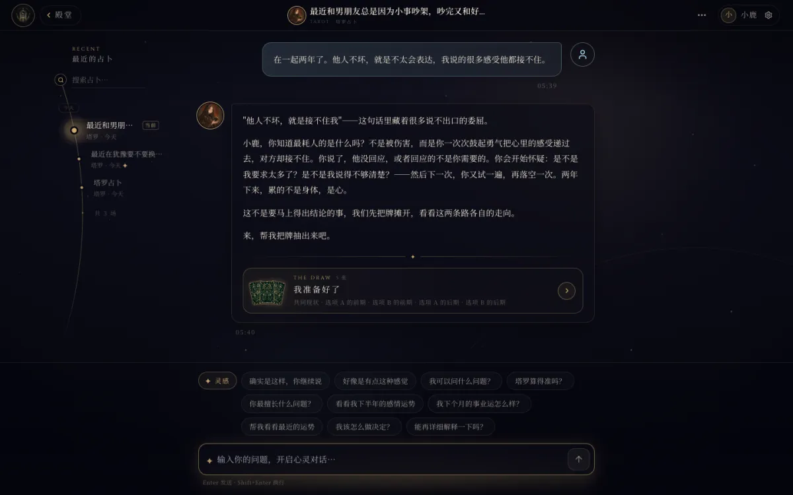
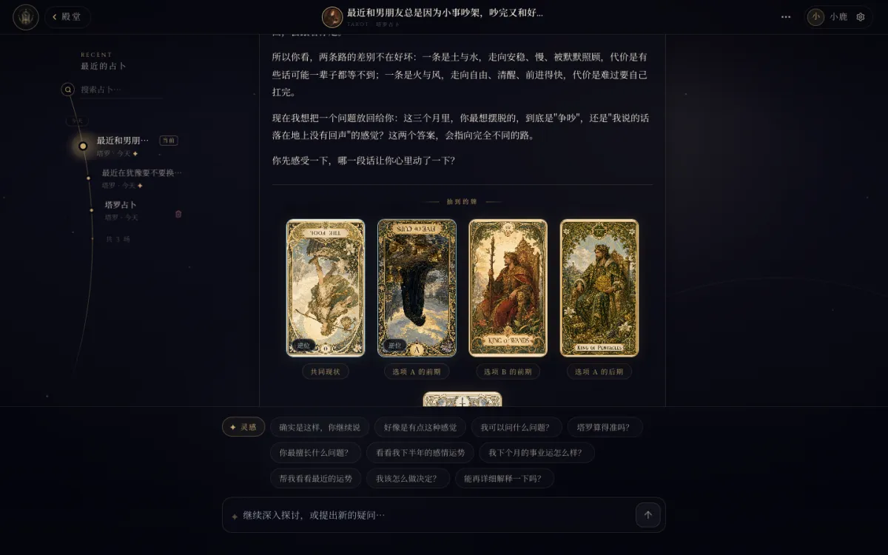
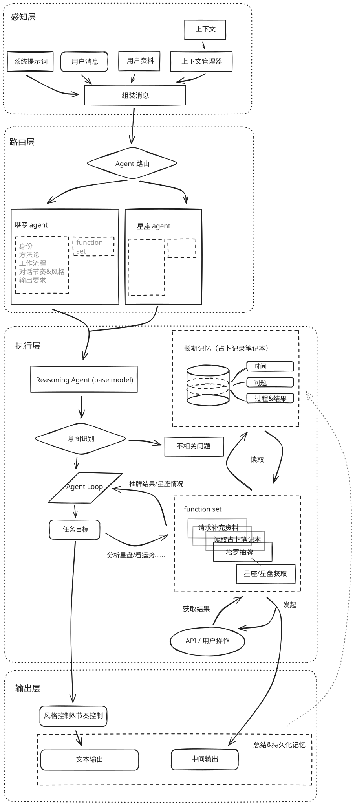

## 快速开始

试用：[xiaox.art](https://xiaox.art)

部署：参考 [本地部署](#本地部署)

## 运行示例




---

## 产品理念

### **占卜是占卜师用玄学工具让问卜者重新认识自己的过程**  

产品设计刻意反对在占卜过程中的单向输出，反对“把塔罗/星盘当成知识讲解”的做法，反对为了追求准确而说空话，而是在对话中，逐渐建立链接，焦点永远回归人的情绪状态和真实困惑。让问卜者收获超越问题本身的答案。
---

## 关键特性

1. “准”不是模糊笼统的说法带来的，而是经验和牌意的精准结合。从3个维度把控AI输出精准的内容：
- 占卜师能根据问卜者的个人信息、占卜历史，解读。结合塔罗和星盘
- 有节奏的输出，市场上大部分产品都会一次性把所有解读输出，没有留给用户交互的余地，每次输出内容都是轻盈的，真实自然的。
- 占卜不是牌意的学习环节，模版化的解读最终的感受是，牌意看似很准，内容很满，但是都是空话。应该借助塔罗，星座这两面镜子，回归到人身上，带着问卜者一起去找到自己的答案，所以这个流程是需要保持交流，引导的，而不是模型单方面的输出

2. 有风格、性格不同的占卜师。在语气、话术节奏和解读风格上对两位虚拟占卜师做了差异化设定，如一位更柔和轻松，一位更直接。在和占卜师的交流中，“直接型”的占卜师比“委婉型”的要多，往往初次接触占卜的人群会倾向于委婉型的，但往往抓住人心的是那些“不留情面的”占卜师，问卜者总会选择性记住被直接命中的“话语”。

---

## 用户类型与核心使用场景

- **1）什么都问型——高频陪伴用户**  
  - 特征：已经把产品当作“日常情绪与决策的出口”，恋爱、工作、人际、生活小事都会来问。  
  - 核心需求：稳定的熟悉的占卜师、记得自己过往经历,不需要每次重新解释背景。  
  - 对应设计：长期记忆笔记本、丰富的占卜体验设计，个性化的解读设计

- **2）小白型——第一次接触占卜/星盘的新人**  
  - 特征：可能不了解塔罗和星盘的区别，只是“听说挺准、想试试”。  
  - 核心需求：门槛低，有引导，不被专业术语吓退。  
  - 对应设计：沉浸式的占卜体验设计、预设问题、一站式的解读设计

- **3）头脑一热型——短期需求的“临时求助”用户**  
  - 特征：某个节点突然很焦虑（比如临近决定、感情挫折），希望快速获得一点安慰或视角。  
  - 核心需求：上手快、反馈及时、回答有情绪价值。  
  - 对应设计：低体验门槛，科学的占卜体验设计

- **4）临时用户转注册用户机制**  

简单分成4种用户类型，用户各自又会带着各种目标
    - 已经有答案型。我来表达自己的现状，来寻找认同和确认的，不在乎结果是否和自己所愿，不符合自己就是“不准”
    - 辅助决策型。常见一些无关重要的短期运势问题，是非问题，日常问题。对于问卜者而言可以接受任何的结果，自己没有答案倾向，问卜者的目的是来寻求一个理由，让自己做选择
    - 探索好奇型。常见询问长期运势类问题，个人选择类问题。问卜者实际不寻求答案，也不做任何决策，目的是想了解玄学视角，加深自我认知
    - 玄学目的型。专业型用户，自我觉察和玄学认知都很高。真正有玄学目的的群体（几乎接触不到）
    - 当然不排除混合目的的，我已有答案，我来这表达，我希望得到来自第三方的确认“塔罗/星盘”，如果符合我会很开心去做某事，如果不符那我可能会想想然后还是去做这件事。
    - 在占卜过程中普通用户的3种目标又会变化。可能一开始是带着答案，但是逐渐变成辅助决策……

---

## 开发踩坑记录 -- 2025.10


### **Function Calling Agent Loop + 多工具协同**
  
  - function calling 成功率优化
    在项目开发过程中，最开始是使用的朴素的提示词工程方法的 function calling 实现，具体是在提示词中声明 function set，工具的作用，参数详细解析，当 agent 试图使用工具时，必须输出 \<function call> tag 包裹的 json 格式的参数表 parameter book，然后主动识别 agent 的结果是否有指定的 tag，调用对应的 function，这种方式的实现逻辑非常简单，但调用成功率，调用效果非常一般，受 agent 模型能力的影响，非常不稳定。如果 agent 不能按预期输出准确格式的 function calling，还会造成文本的混乱。如果继续往这个方向走，那么要考虑更换能力更强，更遵守指令的模型，也要做 agent 输出的格式规范检查器，进一步检查异常输出，修复异常输出。于是权衡后使用了 google generativeai 的 function calling 框架。在FunctionDeclaration 中对工具详细描述，并在提示词中各个使用场景重申，提高工具调用成功率。

### 前端代码实现
  前端代码主要使用 Claude Sonnet 4.5 和 GPT-5.1 Codex完成，Sonnet 主要完成基本框架的搭建，GPT-5.1 Codex 完成细节调整，风格增强，效果优化的核心部分。Sonnet 是当前业界公认有强编码能力的模型，实际使用过程中，能够快速完成基本前端框架的搭建，但是缺乏理解细节，修缮细节的能力。例如在塔罗牌抽牌的整个流程中（洗牌，选牌，抽牌）Sonnet 能够保证流程的顺利完成，如转场，基本功能，与后端对接。但一旦触及到修缮细节，增加特效，Sonnet 则很难完成，相反 Codex 能够完全理解并执行。例如，**选牌动画效果**是通过扇形可滑动的选牌器，配合动态补牌的方式实现，要求转动效果顺畅，大小，位置合适无遮挡。实现主要遇到下面几个问题：
  - **“扇形”的理解，扇形转动效果的实现：**
    保证抽牌功能的正确后，用以下的提示词生成
    ```
    PROMPT(抽牌基本功能已完成 CONTEXT): 用户点击开始抽牌后，在抽牌界面中央，牌阵位置下方新增一个扇形可转动的选牌器，
    塔罗牌扇形向上展开，用户可以滑动选牌器使扇形绕着扇形的圆心平面转动，用户选择特定的牌后，塔罗牌高亮并从扇形中有抽出效果。
    所有塔罗牌上需要表明序号从1开始共78张牌
    ```
    Sonnet 给出的初版选牌器没有正确理解扇形转动，先是给出通过翻页实现的静态“转动”效果，明确不是翻页而是动态运动后，给出了一个用三角函数模拟的轨迹实现塔罗牌的运动，稍调整 PROMPT 明确塔罗牌排布形状后给出弧度非常小，像曲线一样的长弧形选牌器，然后再也无法调整弧度，和选牌器大小，空间占位，而且渲染效果非常卡顿。多次尝试失败后决定使用 Codex。
    Revert 所有 Sonnet 的改动，提供给 Codex 几乎相同的 PROMPT, Codex 给出很接近最终实现的效果，并且自己理解并补充了塔罗牌在“扇形窗口”被滑动后应淡出消失在画面边缘，并有新的牌补充进来的效果，在滑动的过程中也模拟了从扇形圆心“发牌”的效果。
  - **扇形选牌器位置调整，避免遮挡**
    剩下需要继续微调的是整个扇形选牌器的位置，大小，弧度。这点对于前端工程师是很简单的工作，但是模型无法理解组件之间的遮挡关系，相对位置关系，导致总是无法正确调整位置，例如 Sonnet 无法正确处理类似
    ```
    PROMPT：选牌器位置左右居中，垂直位置不变，选牌器挡住了牌阵显示的槽位，把槽位上移，选牌器下移
    ```
    需要修改相对位置的指令。因为模型无法观察界面，也无法验证自己的修改，无法感知修改是否生效，所以不能给出好答案。而相比之下 Codex 在进一步提示下，效果明显优于 Sonnet。
  - **扇形选牌器位置调整，位置正确**
    调整相对位置后，预期扇形选牌器应在界面最底部，这样滑动的效果能够自然淡出淡入，但是无论是 Codex 还是 Sonnet，都无法完成进一步调整，扇形始终保持在界面较上方的位置不变，Sonnet 只会反复修改选牌组件的位置参数，始终无法意识到位置参数的修改实际不生效。Codex 会尝试更深入的修改，直到我意识到修改无效的原因是：扇形选牌器组件的实际大小比可见的扇形要大，扇形选牌器还包括下方的不可见的滑动补牌特效后，Codex 才真正理解作出正确的修改 -- 把不可见的补牌特效缩小。
  
  经过上面几个关键的前端界面的修改，一个十分重要的 learning 是 Codex 目前在前端的编码能力要优于 Sonnet，原因是 Codex 更能理解自然语言，当使用“扇形选牌器”，“补牌特效”，“抽牌器”这些名词描述时，模型必须有能力将其和代码的组件对应起来，即便代码中有明确的注释。Codex 在指代关系映射能力上优于 Sonnet，造就了前端能力的差异。


## 盈利模式设想

在当前免费 / 试验阶段的基础上，可以围绕情绪价值 + 记忆沉淀 + 仪式感”设计多层收费模型：

- **1）会员订阅制（基础变现主轴）**  
  - 免费层：保留核心占卜体验，但限制每日占卜次数、历史笔记保留时长。  
  - 会员层：解锁更长历史笔记留存、更高的每日对话上限、更完整的星盘解读、专属主题牌阵（如年度、季度复盘）。  
  - 高级层：提供每周/每月自动推送本周运势 + 与上次占卜对照”的专属报告。

- **2）一次性付费内容 / 主题套餐**  
  - 主题牌阵包：如“感情疗愈系列”“事业转折期系列”“年度复盘与新年愿望”等。  
  - 深度报告：基于星盘 + 历史笔记生成报告，可导出或打印，作为仪式感极强的“命盘档案”。（测测）
  - 特殊节日活动：情人节、生日、年末等节点的限时主题牌阵或活动。（cool）
  - 限定占卜师 agent

- **3）个性化皮肤**  
  - 自定义牌面皮肤、抽牌桌布背景、占卜师头像与称号等虚拟物品。  
  - 允许用户通过连续使用或购买解锁，强化身份感与归属感。

---

## 本地部署

后端 FastAPI + SQLite，前端 React + Vite。需要 Python 3.9+、Node 20+。

### 1. 安装依赖

```bash
git clone https://github.com/ZhanfanZhou/tarot-astro.git && cd tarot-astro
python3 -m venv venv && venv/bin/pip install -r requirements.txt
cd frontend && npm install && cd ..
```

### 2. 准备牌图

牌图体积较大，不在仓库里。把一套 78 张的塔罗牌图放到 `frontend/public/tarot-images/decks/<deck-id>/`，目录结构和命名见 [`frontend/public/tarot-images/README.md`](frontend/public/tarot-images/README.md)。

### 3. 配置 `.env`

```bash
cp .env.example .env
```

在仓库根目录的 `.env` 里至少填这几项（全部配置项及说明见 [`.env.example`](.env.example)）：

```ini
GEMINI_API_KEY=...            # 默认三个 Agent（开场 / 解读 / 笔记）都用 Gemini
SECRET_KEY=...                # JWT 签名密钥，随机串即可：python3 -c "import secrets; print(secrets.token_urlsafe(32))"
ASTROLOGY_ACCESS_TOKEN=...    # 星盘 API，占星相关功能需要
ADMIN_PASSWORD=...            # 可选，配了才开放后台 /admin
```

想改用 DeepSeek 或 Kimi：填对应的 `DEEPSEEK_API_KEY` / `KIMI_API_KEY`，再把 `OPENING_*`、`READING_*`、`MEMORY_*` 的 provider 和 model 改成相应的值（`.env.example` 里有示例）。配完可以运行下面的命令，它会给每个 Agent 发一次真实请求，检查 key 和模型是否可用：

```bash
venv/bin/python backend/scripts/check_providers.py
```

### 4. 启动

```bash
# 终端 1：后端，监听 :8000
cd backend && ../venv/bin/uvicorn main:app --reload --port 8000

# 终端 2：前端，监听 :5173，/api 请求由 Vite 转发到 :8000
cd frontend && npm run dev
```

浏览器打开 http://localhost:5173 ，选「游客模式」就能开始占卜。后端接口文档在 http://localhost:8000/docs 。

运行数据（用户、会话、笔记等）会写在 `backend/data/` 下，首次启动时自动创建。
