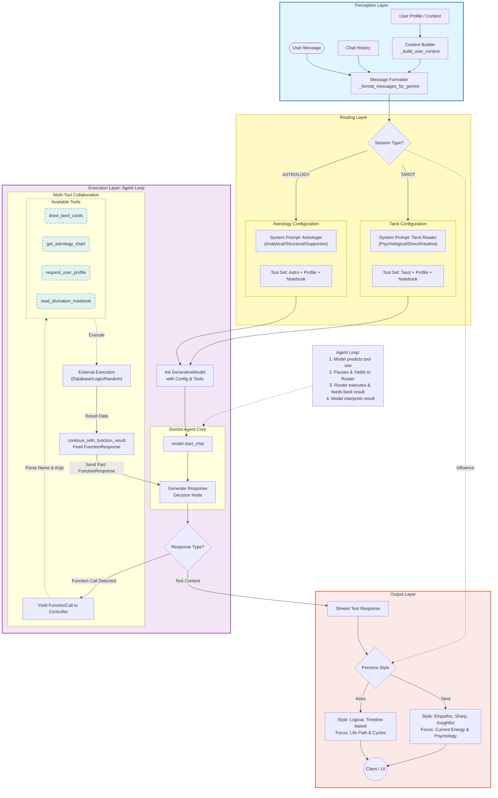

# Gemini Agent Loop & Function Calling Architecture

```mermaid
flowchart TD
    %% Define Styles
    classDef perception fill:#e1f5fe,stroke:#01579b,stroke-width:2px;
    classDef routing fill:#fff9c4,stroke:#fbc02d,stroke-width:2px;
    classDef execution fill:#f3e5f5,stroke:#7b1fa2,stroke-width:2px;
    classDef tools fill:#e0f2f1,stroke:#00695c,stroke-width:1px,stroke-dasharray: 5 5;
    classDef output fill:#fbe9e7,stroke:#d84315,stroke-width:2px;
    classDef gemini fill:#e8eaf6,stroke:#3f51b5,stroke-width:4px;

    %% Layer 1: Perception Layer
    subgraph Perception [Perception Layer]
        UserInput([User Message])
        UserContext[User Profile / Context]
        History[Chat History]
        
        ContextBuilder["Context Builder<br/>_build_user_context"]
        MsgFormatter["Message Formatter<br/>_format_messages_for_gemini"]
        
        UserContext --> ContextBuilder
        UserInput & History & ContextBuilder --> MsgFormatter
    end
    class Perception perception

    %% Layer 2: Routing Layer
    subgraph Routing [Routing Layer]
        SessionType{Session Type?}
        
        subgraph Config_Tarot [Tarot Configuration]
            TarotPrompt["System Prompt: Tarot Reader<br/>(Psychological/Direct/Intuitive)"]
            TarotTools[Tool Set: Tarot + Profile + Notebook]
        end
        
        subgraph Config_Astro [Astrology Configuration]
            AstroPrompt["System Prompt: Astrologer<br/>(Analytical/Structural/Supportive)"]
            AstroTools[Tool Set: Astro + Profile + Notebook]
        end
        
        MsgFormatter --> SessionType
        SessionType -- TAROT --> Config_Tarot
        SessionType -- ASTROLOGY --> Config_Astro
    end
    class Routing,Config_Tarot,Config_Astro routing

    %% Layer 3: Execution Layer (The Agent Loop)
    subgraph Execution [Execution Layer: Agent Loop]
        InitModel["Init GenerativeModel<br/>with Config & Tools"]
        
        subgraph Gemini_Agent [Gemini Agent Core]
            StartChat[model.start_chat]
            GenResponse["Generate Response<br/>Decision Node"]
        end
        
        CheckType{Response Type?}
        
        %% Tool Execution Cycle
        subgraph Tool_Collaboration [Multi-Tool Collaboration]
            YieldCall[Yield FunctionCall to Controller]
            
            subgraph Tools_Available [Available Tools]
                T1(draw_tarot_cards)
                T2(get_astrology_chart)
                T3(request_user_profile)
                T4(read_divination_notebook)
            end
            
            ExternalExec["External Execution<br/>(Database/Logic/Random)"]
            ResumeLoop["continue_with_function_result<br/>Feed FunctionResponse"]
        end
    end
    class Execution,Gemini_Agent execution
    class Gemini_Agent gemini
    class Tools_Available,T1,T2,T3,T4 tools

    %% Connections for Execution
    Config_Tarot --> InitModel
    Config_Astro --> InitModel
    InitModel --> StartChat
    StartChat --> GenResponse
    GenResponse --> CheckType
    
    CheckType -- "Function Call Detected" --> YieldCall
    YieldCall -.-> |Parse Name & Args| Tools_Available
    Tools_Available -.-> |Execute| ExternalExec
    ExternalExec --> |Result Data| ResumeLoop
    ResumeLoop --> |Send Part: FunctionResponse| GenResponse
    
    %% Layer 4: Output Layer
    subgraph Output [Output Layer]
        StreamText[Stream Text Response]
        FinalStyle{Persona Style}
        
        TarotStyle["Style: Empathic, Sharp, Insightful<br/>Focus: Current Energy & Psychology"]
        AstroStyle["Style: Logical, Timeline-based<br/>Focus: Life Path & Cycles"]
        
        ClientUI((Client / UI))
    end
    class Output output

    %% Connections to Output
    CheckType -- "Text Content" --> StreamText
    StreamText --> FinalStyle
    
    SessionType -.-> |Influence| FinalStyle
    FinalStyle -- Tarot --> TarotStyle
    FinalStyle -- Astro --> AstroStyle
    
    TarotStyle --> ClientUI
    AstroStyle --> ClientUI

    %% Annotations
    note_loop["Agent Loop:
    1. Model predicts tool use
    2. Pauses & Yields to Router
    3. Router executes & feeds back result
    4. Model interprets result"]
    
    note_loop -.-> Gemini_Agent
```
